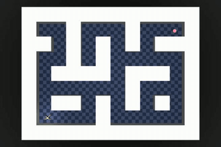
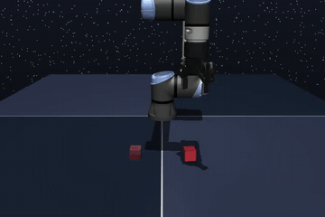
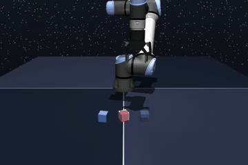
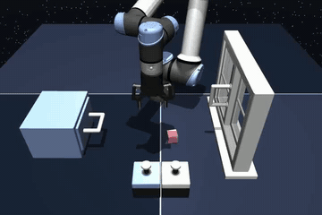
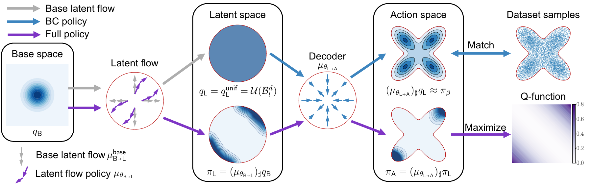

<div align="center">

# LASER

[](https://openreview.net/forum?id=n2D2Gf0jYw) [](https://mit-realm.github.io/laser/)

**Latent Space Adjoint Matching for Support-Constrained Entropy-Regularized Offline RL**

Official JAX implementation.

[Songyuan Zhang](https://syzhang092218-source.github.io/),
[Oswin So](https://oswinso.xyz/),
[Eric Yang Yu](https://ericyangyu.github.io/),
[Matthew Cleaveland](https://www.linkedin.com/in/matthew-cleaveland-4775abba/),
[Peter Crowley-Dolen](https://www.linkedin.com/in/peter-crowley2/?isSelfProfile=false), and
[Chuchu Fan](https://chuchu.mit.edu/)

[Dependencies](#dependencies) •
[Installation](#installation) •
[Quickstart](#quickstart) •
[Environments](#environments) •
[Algorithms](#algorithms) •
[Usage](#usage) •
[Citation](#citation)

</div>

<div align="center">
  <a href="media/antmaze-large.mp4"></a>
  <a href="media/cube-single.mp4"></a>
  <a href="media/cube-double.mp4"></a>
  <a href="media/scene.mp4"></a>
</div>

<div align="center">
  
</div>

LASER learns a flow-based behavior-cloning decoder, then optimizes an expressive policy in its bounded latent space. Adjoint matching trains the latent flow without backpropagation through its full trajectory, combining **support constraints** with **entropy regularization**.

## Dependencies

We recommend Python 3.12 in a fresh Conda environment:

```bash
conda create -n laser python=3.12
conda activate laser
```

The package requires Python 3.11 or newer. Dependencies are declared in [pyproject.toml](pyproject.toml) and installed automatically with the package.

## Installation

Clone the repository and enter its root directory:

```bash
git clone https://github.com/MIT-REALM/laser.git
cd laser
```

For training on an NVIDIA GPU with CUDA 12 support:

```bash
python -m pip install -e '.[cuda12]'
```

For a headless NVIDIA Linux machine, use EGL for MuJoCo rendering:

```bash
export MUJOCO_GL=egl
```

## Quickstart

Run the following from the repository root to train LASER on `cube-double-play-singletask-task2-v0` using the paper's settings for this environment:

```bash
python scripts/train.py laser --env-name cube-double-play-singletask-task2-v0 \
    --steps 2000000 --horizon-length 5 --action-chunking --pessimism-coef 0.5 --seed 0
```

After training, evaluate the final checkpoint over 50 episodes. Replace the example path with the generated run directory:

```bash
python scripts/test.py \
    --path 'logs/cube-double-play-singletask-task2-v0/laser/seed0_<timestamp>_<id>' \
    --step 2000000 --epi 50 --seed 0 --no-video
```

## Environments

The experiments use state observations from [OGBench](https://github.com/seohongpark/ogbench). Choose the `singletask-task1-v0` through `singletask-task5-v0` variants for reward-maximizing offline RL. Image observations are currently not supported by the agents in this repository.

| Environment | Clean dataset family | Noisy dataset family |
| --- | --- | --- |
| AntMaze Large | `antmaze-large-navigate` | `antmaze-large-explore` |
| Cube Single | `cube-single-play` | `cube-single-noisy` |
| Cube Double | `cube-double-play` | `cube-double-noisy` |
| Scene | `scene-play` | `scene-noisy` |

Append `-singletask-task<N>-v0` to a family name to select a task. Standard datasets are downloaded and cached by OGBench in `~/.ogbench/data`.

The additional Puzzle 4×4 experiment uses `puzzle-4x4-play-singletask-task<N>-v0` with the paper's **100M-transition dataset**, supplied separately through `--dataset-path`. See [OGBench](https://github.com/seohongpark/ogbench) for instructions to use these datasets.

## Algorithms

| CLI name | Method |
| --- | --- |
| `laser` | **LASER**, our method |
| `reform` | [ReFORM: Reflected Flows for On-support Offline RL via Noise Manipulation](https://github.com/MIT-REALM/reform) |
| `fql` | [Flow Q-learning](https://github.com/seohongpark/fql) |
| `ifql` | [Implicit Flow Q-learning](https://github.com/seohongpark/fql), the flow-based IDQL baseline |
| `dsrl` | [Diffusion Steering via Reinforcement Learning](https://github.com/ajwagen/dsrl), adapted to offline RL with a flow decoder |
| `qam` | [Q-learning with Adjoint Matching](https://github.com/ColinQiyangLi/qam) |
| `qam-e` | [QAM with an action-editing policy](https://github.com/ColinQiyangLi/qam) |

## Usage

### Train

```bash
python scripts/train.py '<algorithm>' --env-name '<environment>' --seed 0
python scripts/train.py laser -h
```

The help output groups algorithm, dataset, and trainer options. For example, `--inv-temp` controls LASER's inverse entropy temperature, while `--pessimism-coef 0` disables the pessimistic TD-target penalty. `--horizon-length` sets the TD horizon; add `--action-chunking` to also predict and execute action chunks of that length.

Each run gets a unique directory under `logs/<environment>/<algorithm>/`, containing `config.yaml`, model checkpoints, and W&B logs. The configuration records the dataset source and dependency versions. Use `--save-dir` and `--run-name` to customize the output location and run label.

By default, training metrics are logged every 1,000 updates (`--log-interval`), validation losses every 10,000 (`--eval-interval`), and environment success over 20 episodes every 50,000 (`--test-interval`, `--test-epi`). Checkpoints are saved every 100,000 updates (`--save-interval`), including the initial and final models.

Use `WANDB_MODE=offline` for local logging, or log in with `wandb login` to use online tracking. Each invocation starts a new training run.

### Test and record videos

```bash
python scripts/test.py --path '<run-directory>' --step 2000000 --epi 50 --seed 0
python scripts/test.py -h
```

Testing reports mean reward and success rate. Videos are written to `<run-directory>/videos/step_<step>/`. Add `--no-video` to skip recording. If `--step` is omitted, the latest saved checkpoint is loaded. Use the final checkpoint for paper comparisons.

### Reproducing the paper

The commands below use LASER's paper settings. Its method-specific hyperparameters remain fixed across environments (`--inv-temp 10` and `--sigma0-conf-level 0.999`, both defaults), while the training budget, action chunk length, and pessimism coefficient vary as shown, same as all other methods. All other options use their defaults.

<details>
<summary><b>Click to expand the full list of LASER commands</b></summary>

Change `task1` to `task2`, `task3`, `task4`, or `task5` to run each task.

```bash
# AntMaze Large, clean dataset.
python scripts/train.py laser --env-name antmaze-large-navigate-singletask-task1-v0 \
    --steps 5000000 --horizon-length 1 --no-action-chunking --pessimism-coef 0.5 --seed 0

# AntMaze Large, noisy dataset.
python scripts/train.py laser --env-name antmaze-large-explore-singletask-task1-v0 \
    --steps 8000000 --horizon-length 1 --no-action-chunking --pessimism-coef 0.5 --seed 0

# Cube Single, clean dataset.
python scripts/train.py laser --env-name cube-single-play-singletask-task1-v0 \
    --steps 2000000 --horizon-length 5 --action-chunking --pessimism-coef 0.5 --seed 0

# Cube Single, noisy dataset.
python scripts/train.py laser --env-name cube-single-noisy-singletask-task1-v0 \
    --steps 1000000 --horizon-length 1 --no-action-chunking --pessimism-coef 0 --seed 0

# Cube Double, clean dataset.
python scripts/train.py laser --env-name cube-double-play-singletask-task1-v0 \
    --steps 2000000 --horizon-length 5 --action-chunking --pessimism-coef 0.5 --seed 0

# Cube Double, noisy dataset.
python scripts/train.py laser --env-name cube-double-noisy-singletask-task1-v0 \
    --steps 2000000 --horizon-length 1 --no-action-chunking --pessimism-coef 0 --seed 0

# Scene, clean dataset.
python scripts/train.py laser --env-name scene-play-singletask-task1-v0 \
    --steps 2000000 --horizon-length 5 --action-chunking --pessimism-coef 0.5 --seed 0

# Scene, noisy dataset.
python scripts/train.py laser --env-name scene-noisy-singletask-task1-v0 \
    --steps 2000000 --horizon-length 5 --action-chunking --pessimism-coef 0.5 --seed 0
```

For the additional Puzzle 4×4 experiment, supply the paper's 100M-transition dataset. Replace the path below with the directory containing its training `.npz` shards and matching `-val.npz` files, preserving the original shard order.

```bash
# Puzzle 4x4, clean 100M dataset.
python scripts/train.py laser --env-name puzzle-4x4-play-singletask-task1-v0 \
    --dataset-path /path/to/puzzle-4x4-play-100M \
    --steps 2000000 --horizon-length 5 --action-chunking --pessimism-coef 0.5 --seed 0
```

</details>

Evaluate each final checkpoint over 50 episodes. Set `--step` to the training budget in its command. For a two-million-update run:

```bash
python scripts/test.py --path '<run-directory>' --step 2000000 --epi 50 --seed 0 --no-video
```

The paper reports mean success and population standard deviation across three training seeds, with 50 evaluation episodes per seed. Training curves use 20 episodes every 50,000 updates.

## Code structure

- [laser/agents/laser.py](laser/agents/laser.py): LASER configuration, losses, adjoint targets, and policy sampling.
- [laser/agents/](laser/agents/): baseline algorithms and shared network modules.
- [laser/trainer/](laser/trainer/): datasets, training, evaluation, and checkpoint utilities.
- [scripts/](scripts/): training and evaluation entry points.

## Acknowledgements

This implementation builds on [ReFORM](https://github.com/MIT-REALM/reform) and [FQL](https://github.com/seohongpark/fql), with baseline implementations adapted from [QAM](https://github.com/ColinQiyangLi/qam) and [DSRL](https://github.com/ajwagen/dsrl). We thank the authors of these projects and [OGBench](https://github.com/seohongpark/ogbench) for releasing their code and datasets.

## Citation

If you find LASER useful in your research, please cite:

```bibtex
@inproceedings{zhang2026laser,
  title={{LASER}: Latent Space Adjoint Matching for
         Support-Constrained Entropy-Regularized Offline {RL}},
  author={Zhang, Songyuan and So, Oswin and Yu, Eric Yang and
          Cleaveland, Matthew and Crowley-Dolen, Peter and Fan, Chuchu},
  booktitle={Advances in Neural Information Processing Systems},
  year={2026}
}
```
